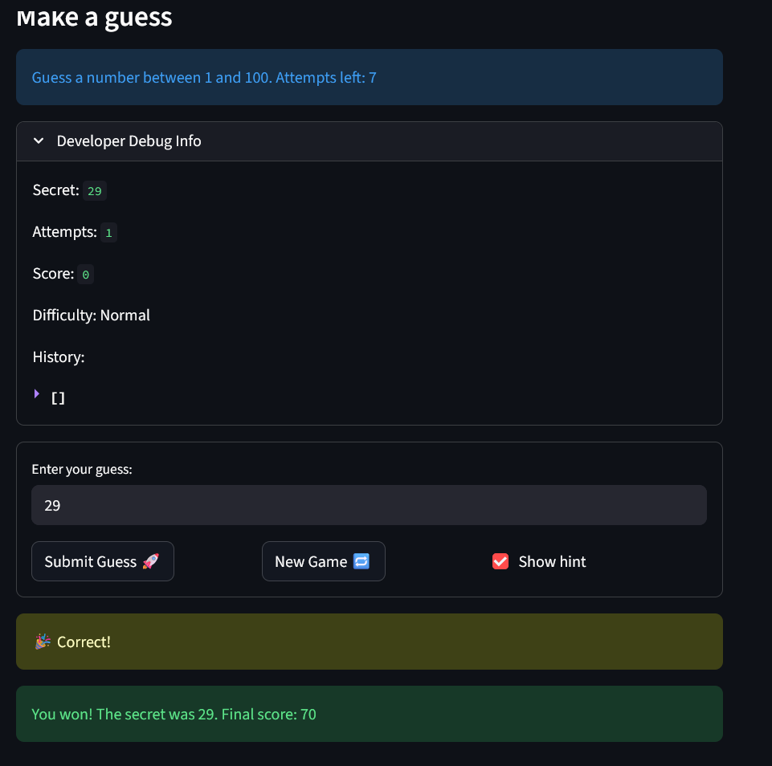

# 🎮 Game Glitch Investigator: The Impossible Guesser

## 🚨 The Situation

You asked an AI to build a simple "Number Guessing Game" using Streamlit.
It wrote the code, ran away, and now the game is unplayable. 

- You can't win.
- The hints lie to you.
- The secret number seems to have commitment issues.

## 🛠️ Setup

1. Install dependencies: `pip install -r requirements.txt`
2. Run the broken app: `python -m streamlit run app.py`

## 🕵️‍♂️ Your Mission

1. **Play the game.** Open the "Developer Debug Info" tab in the app to see the secret number. Try to win.
2. **Find the State Bug.** Why does the secret number change every time you click "Submit"? Ask ChatGPT: *"How do I keep a variable from resetting in Streamlit when I click a button?"*
3. **Fix the Logic.** The hints ("Higher/Lower") are wrong. Fix them.
4. **Refactor & Test.** - Move the logic into `logic_utils.py`.
   - Run `pytest` in your terminal.
   - Keep fixing until all tests pass!

## 📝 Document Your Experience

- [ ] Describe the game's purpose.
The purpose of this game is to guess a randomly generated number between 1 and 100. 
- [ ] Detail which bugs you found.
Three bugs that I found were:
1. The hint is backwards, telling you to go lower when the number is actually higher, or higher when the number is actually lower.
2. Pressing the New Game button doesn't reset attempts or history from previous game, and should remove the "You already won" message
3. Pressing enter to submit a guess doesn't work
- [ ] Explain what fixes you applied.
I fixed all three of these bugs by utilizing Copilot AI. The backwards hint was fixed by fixing a bug in the comparison logic, the New Game resetting functionality was added to the existing code, and pressing Enter to submit a guess worked by creating a form to submit the guess in.

## 📸 Demo

## 🚀 Stretch Features

- [ ] [If you choose to complete Challenge 4, insert a screenshot of your Enhanced Game UI here]
